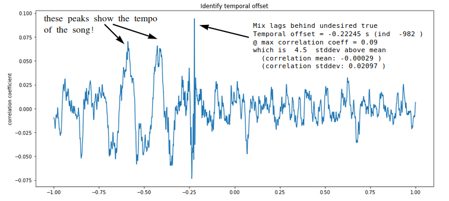
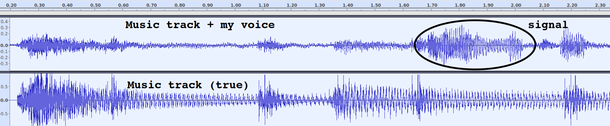
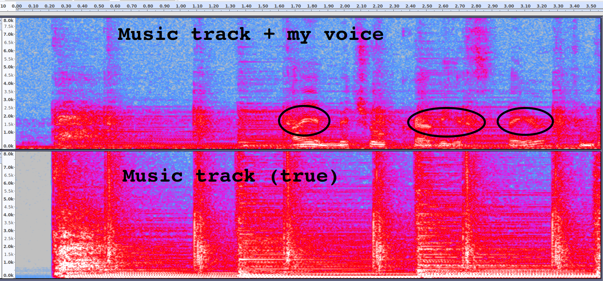
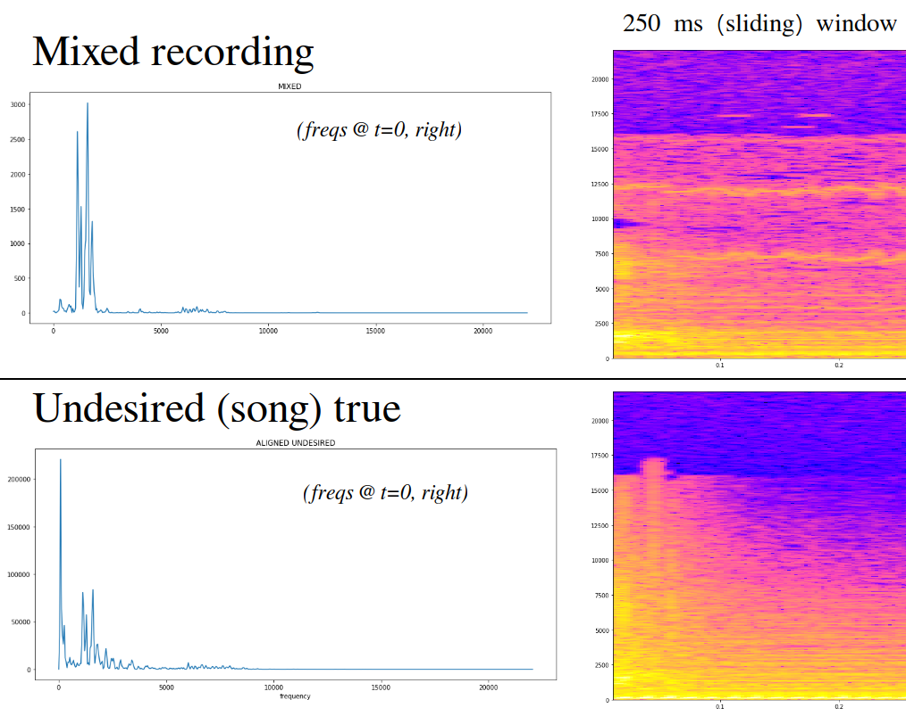
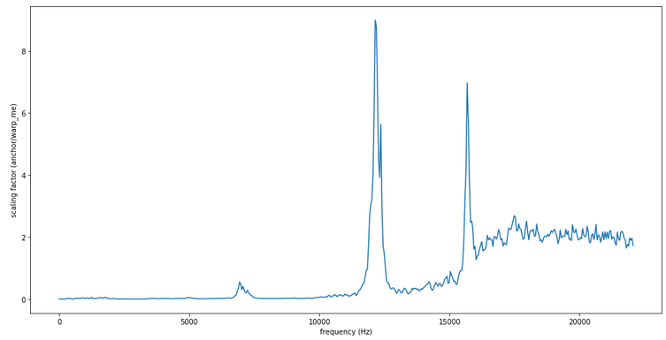
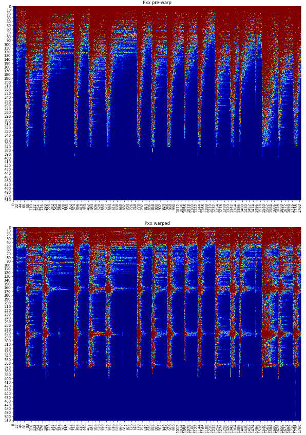
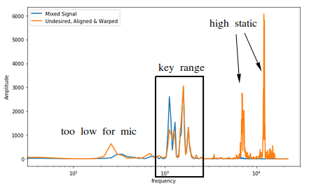
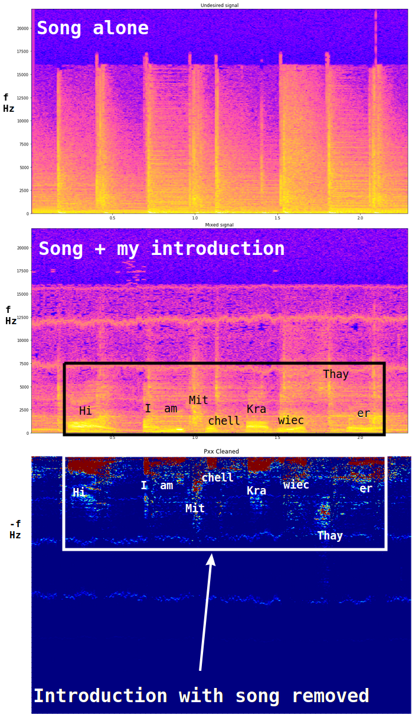

# TrackSubtract
Automatic removal of copyrighted music from audio streams.

2018.06.06 MPKT

## Goal
Most major video-sharing platforms scan content for copyrighted audio. When infringing audio is detected in the background of a file, it is either deleted or muted. Either option results in fewer files, less revenue, and frustrated users. TrackSubtract provides a one-click product for removing unwanted copyrighted music from any audio file.

## Data product
### Consumer/individual interface
Users arrive at a webpage with 4 feature:
-  Select file to upload
-  Enter payment information (if new/unregistered user)
-  Select output format
-  Press "GO" to begin

### High-volume customer API
High-volume users (e.g. platforms for video sharing, etc) can access a pay-per-audio-second API for removing music from audio tracks en masse

## Algorithm
A user submits an audiofile labeled `SongAndSignal` that contains both the desired audio and a undesirable background song.
-  A music identification service (such as the open-source EchoPrint) identifies the song track in the background
-  A file containing labeled `SongTrue` is obtained, containing a clean version.
-  Signal correlation between the `SongAndSignal` and `SongTrue` is calculated as a function of lag time to identify the temporal offset.
-  A normalization factor at each frequency is applied to the undesired waveform, to warp its spectrogram to that of the mixed signal.
-  The aligned and scaled undesired signal is subtracted from the mixture (in the frequency domain)
-  A waveform representation is obtained using Griffin and Lim's algorithm to recover an audio signal given only the magnitude of its Short-Time Fourier Transform (STFT), i.e. its spectrogram. The Griffin and Lim method is described in the paper: *Griffin D. and Lim J. (1984). "Signal Estimation from Modified Short-Time Fourier Transform". IEEE Transactions on Acoustics, Speech and Signal Processing. 32 (2): 236–243. doi:10.1109/TASSP.1984.1164317*

## Data

**For unknown reasons, not all media players read these wave files correctly. When in doubt, use VLC**

The `INPUT1_SongAndSignal.wav` file contains a recording of me talking, while "Hey" plays in the background.

The `INPUT2_SongTrue.wav` file contains a recording of the song "Hey" from the BenSound.com royalty-free audio website.

The `RESULT_reconstructed_signal.wav` file is the output from the script, with the music removed.

## Preliminary results:

The temporal offset between `SongTrue` and `SongAndSignal` is easily determined by checking lag correlation. The maximum in correlation shows the offset, and nearby local maxima show multiples of the beat.

The below figures each show a visual representation the two files described above
-  **Top:** The recording of my voice while Hey plays in the background (`SongAndSignal`).
-  **Bottom:** The pure recording of the song (`SongTrue`)

The amplitudes below are raw, **not** normalized yet. In this particular case, the music signal in the `SongAndSignal` is quieter than `SongTrue`, so the latter would need to be attenuated to match. The opposite case may be true in other situations, perhaps within the same audio file. There is no need to treat these as separate cases; whether to amplify or attenuate is reflected in whether A(t,f) is greater or less than unity.

`TracksWaveform_marked.png` shows both files represented as waveform time series:

`TracksSectral_marked.png` shows the spectral representation:

The below figure shows the approach for calculating the attenuation factor. The spectrograms on the right show a 250 ms slice of the aligned recordings. The left side shows the frequency decomposition at the left edge (e.g. t=0) of the respective spectrograms.

The mixed recording clearly contains an attenuated signal from the song in the 1 kHz - 5 kHz midrange frequencies. However, the strong bass frequencies (< 1kHz) in the undesired song true signal were not transferred into the recording (likely due to the low quality of the mic). Thus frequency windowing appears to be necessary as well.

One way to handle this might be warping the song's spectrogram to better match the mixed signal's spectrogram at each frequency. The below figure shows the warping ratio at each frequency, attenuating the bass. The two odd spikes are due to frequencies favored by the cheap mic's static.

The results of applying this correction factor are shown below, warping the undesired song to match the profile of the mixed recording. (top = raw, bottom = warped)

This produces excellent matching in the 1 kHz - 5 kHz range that contains the desired signel we wish to extract. The temporal matching and frequency warping appear to cleanly align the two signals. 

The aligned and warped spectrogram is effectively scaled for removal from the mixed signal. The figures below show the result of cleaning the song out of the recording of my introduction. 

## Misc Notes

-  What does it mean to scale to best match? We are potentially looking for the value of A(t,f) that minimizes Kullback–Leibler divergence over a given window.

-  Looking through the spectral lens, the task at hand can be viewed as subtraction of surfaces in 2-dimensional {time, frequency} space. From this perspective, the A(t,f) attenuation factor can be thought of as the scaling factor for mapping between the surfaces, empirically based on each point's neighborhood (whose size is defined by the width of the time & frequency windows). This is a more visually-intuitive representation for `Signal(t,f) = SignalAndSong(t,f) - A(t,f)*Song(t+temporalOffset,f)`.

-  As a separate approach from the method described above, it might be easier to simply apply blind source separation methods (perhaps singular spectrum analysis / SSA) to `SongAndSignal`, then only recombine sources that don't show strong signal correlation with `SongTrue`.

-  So far, I have been working with mono-channels recordings. It appears that if I had two microphones, I could use independent component analysis (ICA) to separate sources, which would be extremely powerful... The DUET blind source Separation method can separate any number of sources using only two mics. I wonder if recording `SongAndSignal` with a stereo mic would be sufficient to open this toolbox, though I don't think I want to impose that constraint.

-  Principal component analysis (PCA) might be able to complete the task without the multi-mic requirement of ICA.

-  To test whether or not a removal has been successful is as simple as checking the output against the music identification service again. If it can recognize the song from the output, another treatment is necessary to scrub its remnants.

-  Thanks to the Insight Remote 2018 cohort and Amir Assadi for helping me bounce these ideas around. :- )

-  Unless the source and microphone are perfectly stationary with respect to each other, it will be necessary to identify the coarse temporal offset over the whole song (e.g. the song started 2 min, 21 seconds into the recording), then calculate a more precise offset within each window. Why? Imagine that partway through a recording, the distance between the microphone and source increases: the phases will not match throghout the recording (and there will be a brief Doppler red shift during the movement).
