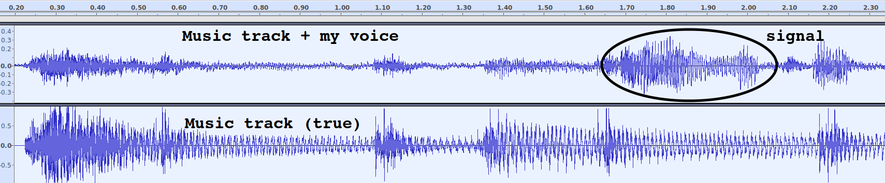
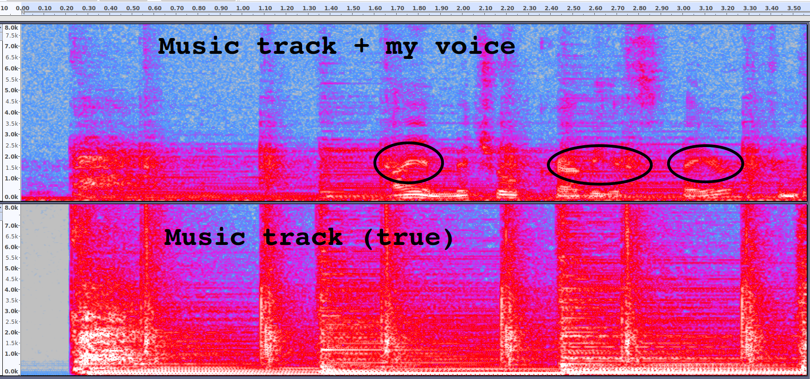

# TrackSubtract
Automatic removal of copyrighted music from audio streams.

2018.06.06 MPKT

## Goal
Most major video-sharing platforms scan content for copyrighted audio. When infringing audio is detected in the background of a file, it is either deleted or muted. Either option results in fewer files, less revenue, and frustrated users. TrackSubtract provides a one-click product for removing unwanted copyrighted music from any audio file.

## Data product
### Consumer/individual interface
Users arrive at a webpage with 4 feature:
-  Select file to upload
-  Enter payment information (if new/unregistered user)
-  Select output format
-  Press "GO" to begin

### High-volume customer API
High-volume users (e.g. platforms for video sharing, etc) can access a pay-per-audio-second API for removing music from audio tracks en masse

## Algorithm
A user submits an audiofile labeled `SongAndSignal` that contains both the desired audio and a undesirable background song.
-  A music identification service (such as the open-source EchoPrint) identifies the song track in the background
-  A file containing labeled `SongTrue` is obtained, containing a clean version.
-  Signal correlation between the `SongAndSignal` and `SongTrue` is calculated as a function of lag time to identify the temporal offset.
-  A sliding correction window (in the time domain) will scan over the song to match the amplitude of `SongTrue` to `SongAndSignal` before subtraction, since this will vary over the course of the recording. Thus the pre-subtraction signal attenuation factor (*A*) is empirically determined as a function of time.
-  In real situations, the attenuation will not be consistent across all frequencies (trivial example: music that was accidentally recorded while being played from a phone speaker will not contain the bass frequencies that are present in `SongTrue`). Consequently, it may be helpful to pass a sliding frequency window within the sliding time window. In this case, the pre-subtraction signal attenuation (*A*) is a calculated as a function of time and frequency.
-  The `SongTrue` is waveform is inverted, scaled by *A*, and added to `SongAndSignal`.

## Quick Eqns
Only taking into account the temporal offset, this can be conceptualized as: `SongAndSignal(t) = Signal(t) + A*Song(t+temporalOffset)`, thus, `Signal(t) = SignalAndSong(t) - A*Song(t+temporalOffset)`

Taking into account (by sliding windows) that the attenuation is a function of both time and frequency: `Signal(t,f) = SignalAndSong(t,f) - *A(t,f)*\*Song(t+temporalOffset,f)`

Given w_t and w_f as the width of the temporal and frequency window, perhaps we are looking for the value of A(t,f) that minimizes Kullback–Leibler divergence over the window `[(t-w_t)<t<(t+w_t), (f-w_f)<f<(f+w_f)]`

## Data
The `SongTrue` file contains a recording of the song "Hey" from the BenSound.com royalty-free audio website.

The `SongAndSignal` file contains a recording of me talking, while "Hey" plays in the background.

## Preliminary results:
The below figures each show a visual representation the two files described above
-  **Top:** The recording of my voice while Hey plays in the background (`SongAndSignal`).
-  **Bottom:** The pure recording of the song (`SongTrue`)

The amplitudes below are raw, **not** normalized yet. In this particular case, the music signal in the `SongAndSignal` is quieter than `SongTrue`, so the latter would need to be attenuated to match. The opposite case may be true in other situations, perhaps within the same audio file. There is no need to treat these as separate cases; whether to amplify or attenuate is reflected in whether A(t,f) is greater or less than unity.

`TracksWaveform_marked.png` shows both files represented as waveform time series:

`TracksSectral_marked.png` shows the spectral representation:

## Misc Notes
-  Looking through the spectral lens, the task at hand can be viewed as subtraction of surfaces in 2-dimensional {time, frequency} space. From this perspective, the A(t,f) attenuation factor can be thought of as the scaling factor for mapping between the surfaces, empirically based on each point's neighborhood (whose size is defined by the width of the time & frequency windows). This is a more visually-intuitive representation for `Signal(t,f) = SignalAndSong(t,f) - A(t,f)*Song(t+temporalOffset,f)`.

-  As a separate approach from the method described above, it might be easier to simply apply blind source separation methods (perhaps singular spectrum analysis / SSA) to `SongAndSignal`, then only recombine sources that don't show strong signal correlation with `SongTrue`.

-  So far, I have been working with mono-channels recordings. It appears that if I had two microphones, I could use independent component analysis (ICA) to separate sources, which would be extremely powerful... The DUET blind source Separation method can separate any number of sources using only two mics. I wonder if recording `SongAndSignal` with a stereo mic would be sufficient to open this toolbox, though I don't think I want to impose that constraint.

-  Principal component analysis (PCA) might be able to complete the task without the multi-mic requirement of ICA.

-  To test whether or not a removal has been successful is as simple as checking the output against the music identification service again. If it can recognize the song from the output, another treatment is necessary to scrub its remnants.

-  Thanks to the Insight Remote 2018 cohort and Amir Assadi for helping me bounce these ideas around. :- )
